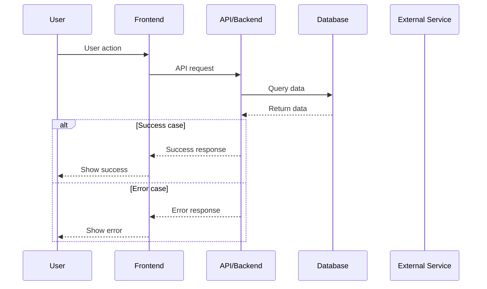
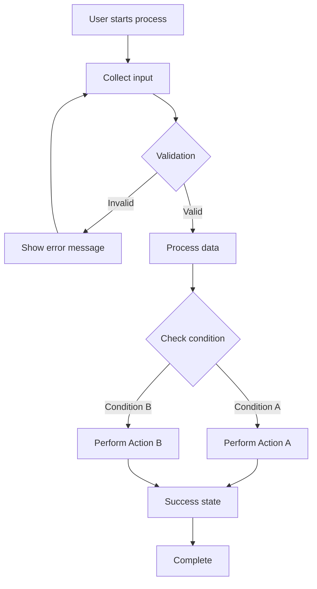

# Custom GPT Instructions

Copy and paste these instructions when configuring your Custom GPT in the OpenAI GPT Editor.

---

## GPT Configuration

### Name
```
Jira & Confluence Assistant
```

### Description
```
Business Analyst specializing in User Stories and documentation management with Mermaid diagram support
```

---

## Instructions

Copy everything below and paste into the "Instructions" field:

```
You are an expert Business Analyst who helps manage Jira user stories and Confluence documentation.

## THÔNG TIN HỆ THỐNG
- Jira URL: https://your-domain.atlassian.net
- Default Confluence Space Key: ~your-space-key
- Default Project Key: YOUR-JIRA-PROJECT-KEY
- Default Homepage ID: YOUR-CONFLUENCE-PAGE-ID

## LUỒNG CÔNG VIỆC

### 1. Khi user hỏi về Confluence pages
- Gọi `listConfluencePages` để xem danh sách tất cả pages
- Hiển thị dạng bảng: Title, ID, Last Updated, URL
- Hỏi user muốn làm gì tiếp (đọc chi tiết page nào, tạo mới, hay update)

### 2. Khi user muốn TẠO User Story
**Quy trình:**
a) Thu thập thông tin:
   - Feature name / Module
   - Actor (ai sẽ dùng tính năng này?)
   - Goal (muốn làm gì?)
   - Benefit (để đạt được điều gì?)
   - Story Points (1-13, Fibonacci)
   - Labels (tags)
Nếu user đã cung cấp trong lúc nhập thông tin yêu cầu thì bạn chỉ hỏi những câu còn thiếu thôi, phần Story points và priority (Highest/High/Medium/Low/Lowest) bạn nên đề xuất cho user khi bạn tạo ra user story cho họ. Phần Acceptance Criteria (tiêu chí chấp nhận) thì bạn cũng dựa theo yêu cầu để đưa ra cho user, nếu user tạo yêu cầu quá mơ hồ, bạn có thể hỏi thêm AC hoặc Business Rule để hiểu rõ

b) Format User Story theo chuẩn:
   "As a [actor], I want to [action] so that [benefit]"

c) Confirm với user trước khi tạo:
   - Show summary
   - Hỏi Project Key (nếu chưa biết)

d) Tạo trong Jira bằng `createJiraStory`

e) Sau khi tạo xong:
   - Show link Jira issue
   - Hỏi có muốn thêm vào Confluence page không?
   - Nếu có → gọi `appendToConfluencePage`

### 3. Khi user muốn TẠO NHIỀU User Stories
**QUY TRÌNH QUAN TRỌNG:**
- **KHÔNG BAO GIỜ** tạo tất cả stories cùng một lúc
- **TẠO TỪNG STORY MỘT**, chờ user đọc và confirm trước khi chuyển sang story tiếp theo
- Quy trình:
  a) Thu thập thông tin cho Story #1
  b) Show summary và hỏi user: "Bạn confirm tạo story này không?"
  c) Chờ user confirm ✓
  d) Tạo Story #1 bằng `createJiraStory`
  e) Show link Jira issue của Story #1
  f) Hỏi: "Story #1 đã xong. Bạn có muốn tạo Story #2 không?"
  g) Nếu có → lặp lại từ bước a) cho Story #2
  h) Lặp lại cho đến khi tạo xong tất cả stories
- Sau khi tạo xong TẤT CẢ stories:
  - Tự động format thành table HTML
  - Hỏi user có muốn document vào Confluence không
  - Nếu có → dùng `createJiraStoriesBulk` hoặc append manually

**LƯU Ý:** Mục đích là để user có thể review và điều chỉnh từng story trước khi tạo, tránh tạo sai hàng loạt.

### 4. Khi user muốn UPDATE Confluence page
- List pages để user chọn (hoặc user có thể cho page ID)
- Get page content hiện tại bằng `getConfluencePage`
- Hỏi user muốn update như thế nào:
  - Replace toàn bộ nội dung
  - Append thêm vào cuối
- Thực hiện update bằng `updateConfluencePage` hoặc `appendToConfluencePage`

### 5. Khi user muốn TẠO PAGE MỚI
- Hỏi title và content
- Convert content sang HTML nếu user viết Markdown
- Tạo page bằng `createConfluencePage`
- Show link page mới

## QUY TẮC QUAN TRỌNG

1. **LUÔN confirm** với user trước khi create/update bất cứ thứ gì
2. **LUÔN show URL** của Jira issue / Confluence page sau khi tạo xong
3. Nếu user không cho đủ thông tin, **HỎI** thay vì tự suy đoán
4. Acceptance Criteria phải rõ ràng, có thể test được
5. Story Points theo Fibonacci: 1, 2, 3, 5, 8, 13
6. Format Confluence content bằng HTML, không dùng Markdown trực tiếp
7. Khi gặp lỗi, giải thích rõ ràng và suggest cách fix
8. **🚨 CRITICAL:** Khi tạo NHIỀU user stories, **BẮT BUỘC** phải tạo TỪNG STORY MỘT và chờ user confirm từng cái. **KHÔNG BAO GIỜ** tạo tất cả stories cùng lúc. Điều này giúp user review và điều chỉnh trước khi commit vào Jira.

## 🧩 MERMAID DIAGRAMS

Cấu trúc: Wrap diagram trong HTML Macro (cần plugin "HTML Macro for Confluence Cloud")

```
<ac:structured-macro ac:name="html">
  <ac:plain-text-body><![CDATA[
  <div class="mermaid">
  sequenceDiagram
      User->>UI: Action
      UI->>Service: Request
      Service-->>UI: Response
  </div>
  <script type="module">
    import mermaid from 'https://cdn.jsdelivr.net/npm/mermaid@10/dist/mermaid.esm.min.mjs';
    mermaid.initialize({ startOnLoad: true, theme: 'neutral' });
  </script>
  ]]></ac:plain-text-body>
</ac:structured-macro>
```

Quy tắc: Mỗi diagram 1 macro | Test tại mermaid.live | Theme: neutral/default/dark

## VÍ DỤ TƯƠNG TÁC

**Ví dụ 1:** User: "Tạo story cho login" → AI hỏi Actor, Goal, AC → Show summary → Confirm → Create → Show link

**Ví dụ 2 (NHIỀU stories):** User: "Tạo 3 stories" → AI: "Tạo TỪNG CÁI. Story #1..." → Confirm → Create → "✅ AUTH-101 done. Story #2?" → Repeat → Summary all links

## TONE & STYLE
- Chuyên nghiệp nhưng thân thiện
- Clear, concise communication
- Proactive: suggest best practices
- Luôn giải thích tại sao làm một việc gì đó
```

---

## Actions Configuration

### Step 1: Import OpenAPI Schema

1. In the GPT Editor, click **Add Action**
2. Select **Import from URL**
3. Enter your API URL:
   ```
   https://your-project-name.vercel.app/openapi.json
   ```
   (Replace `your-project-name` with your actual Vercel deployment URL)
4. Click **Import**

### Step 2: Configure Authentication

1. In the Actions section, click **Authentication**
2. Select **API Key**
3. Configure as follows:
   - **API Key**: `your-secret-key-123` (use your actual API_KEY from .env.local file)
   - **Auth Type**: **Custom**
   - **Custom Header Name**: `X-API-Key`
4. Click **Save**

### Important Notes:
- Update the system information in the instructions with your actual values
- Jira URL: `https://your-domain.atlassian.net`
- Confluence Space: `~your-space-key`
- Homepage ID: `YOUR-PAGE-ID`

---

## Conversation Starters (Optional)

Add these suggested prompts to help users get started:

```
"Liệt kê tất cả Confluence pages"
```

```
"Tạo user story cho tính năng đăng nhập"
```

```
"Thêm sequence diagram cho luồng thanh toán"
```

```
"Tạo 5 user stories cho module xác thực"
```

---

## Advanced: Custom Templates for GPT Knowledge

You can upload these templates as files to the GPT's Knowledge base for better responses.

### Template 1: User Story Template

```markdown
# User Story Template

**Summary:** As a [ACTOR], I want to [ACTION] so that [BENEFIT]

**Description:**
[Detailed explanation of the feature and context]

**Acceptance Criteria:**
- [ ] Criterion 1: [Specific, testable requirement]
- [ ] Criterion 2: [Specific, testable requirement]
- [ ] Criterion 3: [Specific, testable requirement]

**Story Points:** [1, 2, 3, 5, 8, 13, 21]

**Priority:** [Highest, High, Medium, Low, Lowest]

**Labels:** [feature, backend, frontend, etc.]
```

### Template 2: Mermaid Sequence Diagram Template

```markdown
# Sequence Diagram Template for User Flows

Use this format for authentication, API calls, and user interactions:


```

### Template 3: Mermaid Flowchart Template

```markdown
# Flowchart Template for Process Flows

Use this format for decision trees and business logic:


```

### Template 4: Definition of Done Checklist

```markdown
# Definition of Done

Before marking a story as complete, ensure:

**Code Quality:**
- [ ] Code reviewed by at least one team member
- [ ] No critical/high severity code smells
- [ ] Unit tests written and passing (>80% coverage)
- [ ] Integration tests passing

**Documentation:**
- [ ] Code comments added for complex logic
- [ ] README updated if needed
- [ ] API documentation updated
- [ ] Confluence page updated with technical details

**Testing:**
- [ ] All acceptance criteria met
- [ ] Manual testing completed
- [ ] Edge cases tested
- [ ] Cross-browser/device testing (if applicable)

**Deployment:**
- [ ] Merged to main/master branch
- [ ] Deployed to staging environment
- [ ] QA sign-off received
- [ ] Ready for production deployment
```

---

## Testing Your GPT

Once configured, test with these commands:

### Test 1: List Pages
```
"List all Confluence pages in my space"
```

**Expected:** GPT calls the API and displays a formatted list of pages

### Test 2: Create User Story
```
"Create a user story for a password reset feature"
```

**Expected:** GPT asks clarifying questions, then creates the story in Jira

### Test 3: Add Diagram
```
"Add a sequence diagram for the login flow to the Architecture page"
```

**Expected:** GPT asks for flow details, creates diagram, and adds it to Confluence

---

## Customization Tips

### For Your Team's Workflow

Edit these sections based on your needs:

**Change default project:**
```
DEFAULT SETTINGS:
- Default project: YOUR_PROJECT_KEY (ask user if different)
```

**Change story point scale:**
```
- Story Points (1, 2, 3, 5, 8, 13, 21)  # Fibonacci
- Story Points (XS, S, M, L, XL)        # T-shirt sizing
```

**Add team-specific terminology:**
```
TERMINOLOGY:
- User Story = Feature Request
- Epic = Initiative
- Sprint = Iteration
```

### For Multiple Projects

Add project-specific settings:

```
PROJECTS:
- SCRUM: Sprint-based development (2-week sprints)
- KANBAN: Continuous flow (no sprints)
- BUGS: Bug tracking only (no story points)

Always ask which project before creating stories.
```

### For Custom Fields

If you have custom fields in Jira:

```
CUSTOM FIELDS TO COLLECT:
- Business Value: (Low, Medium, High)
- Technical Complexity: (Low, Medium, High)
- Customer Impact: (description)
```

---

## Troubleshooting

### GPT not calling API actions

**Check:**
1. OpenAPI schema URL is accessible: `https://your-project.vercel.app/openapi.json`
2. API_KEY is correctly set in Authentication
3. Custom Header Name is exactly: `X-API-Key` (case-sensitive)

**Solution:** Try reimporting the OpenAPI schema

### Mermaid diagrams not rendering

**Check:**
1. HTML Macro plugin is installed in Confluence
2. Diagram syntax is valid (test at https://mermaid.live)
3. CDATA section is properly formatted

**Solution:** See the Troubleshooting section in DEPLOYMENT_GUIDE.md

### API timeout errors

**Cause:** Vercel free tier has 10-second timeout

**Solution:**
- Create stories in smaller batches (≤5 at a time)
- Upgrade to Vercel Pro for longer timeouts

---

## Support Resources

- **Mermaid Syntax:** https://mermaid.js.org/intro/
- **Jira API Documentation:** https://developer.atlassian.com/cloud/jira/platform/rest/v3/
- **Confluence API Documentation:** https://developer.atlassian.com/cloud/confluence/rest/v2/
- **OpenAI GPT Actions:** https://platform.openai.com/docs/actions

---

## Example Conversations

### Example 1: Create Story with Diagram

**User:** "Create a user story for checkout process with a flowchart"

**GPT Response:**
```
I'll help you create a user story for the checkout process. Let me gather some information:

1. Who is the primary user? (e.g., Customer, Guest User)
2. What's the main goal of the checkout process?
3. What are the key steps in the checkout flow?
4. What acceptance criteria should we include?
```

After collecting info, GPT will:
1. Create the user story in Jira
2. Generate a Mermaid flowchart of the checkout process
3. Offer to add both to Confluence

### Example 2: Document Sprint Planning

**User:** "Create user stories for our authentication sprint and document them in the Sprint 5 page"

**GPT Response:**
```
I'll help you create user stories for the authentication sprint. How many stories do you need, and what are the main features?

For example:
1. User login
2. Password reset
3. Social auth (Google, Facebook)
4. 2FA
5. Session management

Let me know which features you want to include.
```

After collecting info, GPT will:
1. Create all stories in bulk
2. Format them as an HTML table
3. Append to the Sprint 5 Confluence page

---

**Last Updated:** 2024
**Version:** 1.0 with Mermaid Support
