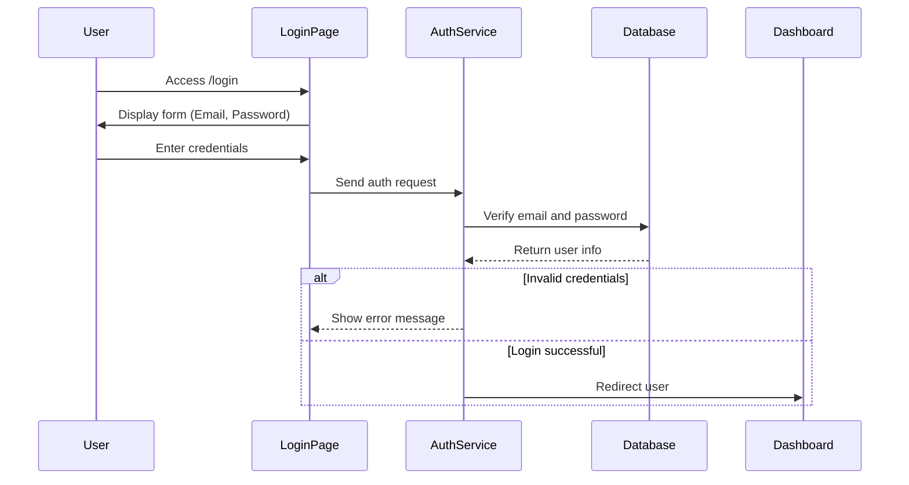
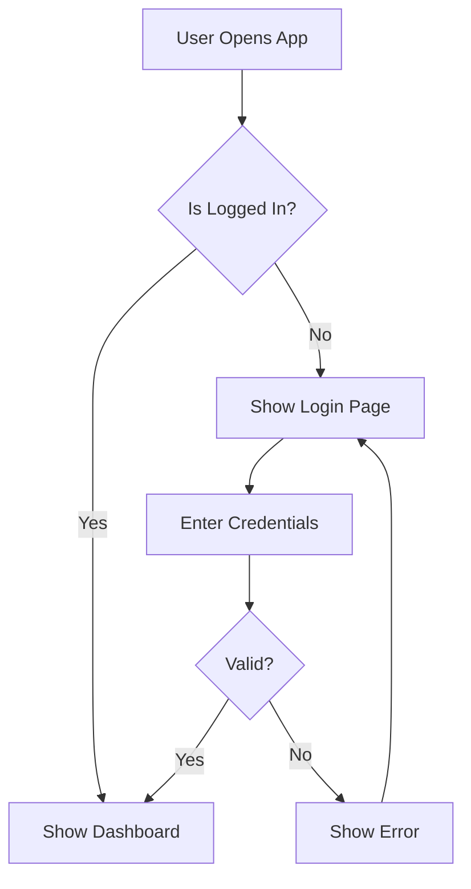

# Jira & Confluence API - Next.js Implementation

Middleware API built with **Next.js 15** to integrate Custom GPT with Jira and Confluence. This is a 1:1 conversion from the original FastAPI (Python) implementation.

## Architecture

```
┌─────────────────┐
│   Custom GPT    │  ← User nói chuyện bằng natural language
└────────┬────────┘
         │ JSON over HTTPS
         │ Header: X-API-Key
         ▼
┌─────────────────┐
│  Middleware API │  ← FastAPI trên Vercel
│                 │
│  ┌───────────┐  │
│  │ Endpoints │  │
│  └─────┬─────┘  │
│        │        │
│  ┌─────▼──────┐ │
│  │  Services  │ │  ← Business logic
│  └─────┬──────┘ │
└────────┼────────┘
         │
    ┌────▼─────┐
    │ Atlassian│
    │   APIs   │
    └──────────┘
```

## Features

- **18 API Endpoints** - Complete Jira and Confluence integration
- **TypeScript** - Full type safety throughout the application
- **Next.js App Router** - Modern Next.js architecture with API routes
- **Custom GPT Ready** - OpenAPI schema included for seamless GPT integration
- **Vercel Deployment** - Optimized for serverless deployment

## API Endpoints

### Confluence Endpoints (7)

1. `GET /api/confluence/space` - Get space information
2. `GET /api/confluence/pages` - List all pages in a space
3. `GET /api/confluence/page/[pageId]` - Get page content
4. `POST /api/confluence/page` - Create new page
5. `PUT /api/confluence/page` - Update existing page
6. `POST /api/confluence/page/[pageId]/append` - Append content to page
7. `GET /api/confluence/search` - Search pages

### Jira Endpoints (7)

1. `GET /api/jira/projects` - List all projects
2. `GET /api/jira/project/[projectKey]/issue-types` - Get issue types
3. `POST /api/jira/story` - Create user story
4. `POST /api/jira/stories/bulk` - Create multiple stories
5. `GET /api/jira/issue/[issueKey]` - Get issue details
6. `GET /api/jira/search` - Search issues using JQL
7. `POST /api/jira/issue/[issueKey]/comment` - Add comment to issue

### Workflow Endpoints (1)

1. `POST /api/workflow/stories-to-confluence` - Create stories in Jira and document in Confluence

### System Endpoints (3)

1. `GET /api` - Root API info
2. `GET /api/health` - Health check
3. OpenAPI schema available at `/openapi.json`

## Quick Start

### 1. Install Dependencies

```bash
cd jira-confluence-nextjs
npm install
```

### 2. Configure Environment Variables

Create a `.env.local` file:

```env
JIRA_URL=https://your-domain.atlassian.net
JIRA_EMAIL=your-email@example.com
JIRA_API_TOKEN=your-api-token-here
DEFAULT_SPACE_KEY=~your-space-key
API_KEY=your-secret-key-123
```

### 3. Run Development Server

```bash
npm run dev
```

Visit http://localhost:3000

### 4. Build for Production

```bash
npm run build
npm start
```

## Deploy to Vercel

### Method 1: Vercel CLI

```bash
# Install Vercel CLI
npm install -g vercel

# Deploy
vercel

# Add environment variables
vercel env add JIRA_URL
vercel env add JIRA_EMAIL
vercel env add JIRA_API_TOKEN
vercel env add DEFAULT_SPACE_KEY
vercel env add API_KEY

# Deploy to production
vercel --prod
```

### Method 2: GitHub Integration

1. Push your code to GitHub
2. Import repository in Vercel dashboard
3. Add environment variables in Vercel project settings
4. Deploy

## Mermaid Diagram Support in Confluence

This middleware now supports adding **Mermaid diagrams** to Confluence Cloud pages using the HTML Macro approach.

### Why Mermaid?

Mermaid allows you to create diagrams and visualizations using a simple markdown-like syntax. Perfect for:
- Sequence diagrams
- Flowcharts
- Class diagrams
- State diagrams
- And more!

### Prerequisites: Install HTML Macro for Confluence

**IMPORTANT**: Confluence Cloud requires a plugin to render HTML content. You must install one of these:

#### Option 1: HTML Macro for Confluence Cloud by Narva Software (Recommended)

1. Go to **Atlassian Marketplace**: https://marketplace.atlassian.com/apps/1229863/html-macro-for-confluence-cloud
2. Click **Get it now** or **Try it free**
3. Select your Confluence site
4. Follow the installation prompts
5. Verify installation by going to **Settings → Manage apps** in Confluence

#### Option 2: HTML for Confluence Cloud by Appfire

1. Go to **Atlassian Marketplace**: https://marketplace.atlassian.com/apps/1213263/html-for-confluence-cloud
2. Click **Get it now** or **Try it free**
3. Select your Confluence site and install

### How It Works

The middleware automatically wraps your Mermaid diagram code in the proper HTML Macro format:

```html
<ac:structured-macro ac:name="html">
  <ac:plain-text-body><![CDATA[
  <div class="mermaid">
  sequenceDiagram
      participant User
      participant UI
      participant Service
      User->>UI: Access /login
      UI->>Service: Send auth request
      Service-->>UI: Return login result
  </div>

  <script type="module">
    import mermaid from 'https://cdn.jsdelivr.net/npm/mermaid@10/dist/mermaid.esm.min.mjs';
    mermaid.initialize({ startOnLoad: true, theme: 'neutral' });
  </script>
  ]]></ac:plain-text-body>
</ac:structured-macro>
```

### Supported Diagram Types

1. **Sequence Diagram** - Show interactions between components
2. **Flowchart** - Visualize decision flows and processes
3. **Class Diagram** - Document system architecture
4. **State Diagram** - Model state transitions
5. **Gantt Chart** - Project timelines
6. **Pie Chart** - Data visualization
7. **Git Graph** - Version control flows

### Example: Adding a Mermaid Diagram via API

```bash
curl -X POST https://your-api.vercel.app/api/confluence/page/131172/append \
  -H "Content-Type: application/json" \
  -H "X-API-Key: your-secret-key-123" \
  -d '{
    "content": "<ac:structured-macro ac:name=\"html\"><ac:plain-text-body><![CDATA[<div class=\"mermaid\">graph TD\n    A[Start] --> B[Process]\n    B --> C[End]\n</div>\n<script type=\"module\">\n  import mermaid from '\''https://cdn.jsdelivr.net/npm/mermaid@10/dist/mermaid.esm.min.mjs'\'';\n  mermaid.initialize({ startOnLoad: true, theme: '\''neutral'\'' });\n</script>]]></ac:plain-text-body></ac:structured-macro>"
  }'
```

### Example Mermaid Diagrams

#### Login Flow Sequence Diagram



#### Simple Flowchart



### Configuration Options

You can customize the Mermaid appearance:

| Theme | Description |
|-------|-------------|
| `default` | Standard Mermaid theme |
| `neutral` | Clean, professional look |
| `dark` | Dark mode theme |
| `forest` | Green-toned theme |

Change the theme in the initialization:

```javascript
mermaid.initialize({
  startOnLoad: true,
  theme: 'dark'  // Change this value
});
```

### Testing Your Diagrams

Before adding to Confluence, test your Mermaid syntax at:
**https://mermaid.live**

### Important Notes

1. **One Diagram Per Macro**: Each `<ac:structured-macro>` should contain only one diagram
2. **Multiple Diagrams**: Create separate macros for multiple diagrams on the same page
3. **No External Scripts**: Confluence blocks external `<script>` tags outside of the HTML Macro
4. **Plugin Required**: Without the HTML Macro plugin, diagrams will not render

### Troubleshooting

**Problem**: Diagram doesn't appear
**Solution**: Verify the HTML Macro plugin is installed and enabled

**Problem**: Syntax error in diagram
**Solution**: Test your Mermaid code at https://mermaid.live first

**Problem**: Multiple diagrams on one page not working
**Solution**: Each diagram needs its own separate `<ac:structured-macro>` block

## Custom GPT Integration

### 1. Create Custom GPT

Go to https://chat.openai.com/gpts/editor

### 2. Configure Instructions

```
You are a Business Analyst specializing in writing User Stories and managing Jira/Confluence.

WORKFLOW:
1. When user asks about Confluence pages: Use GET /api/confluence/pages to list them
2. When user wants to create User Story:
   - Ask for: Feature, Actor, Goal, Acceptance Criteria, Story Points
   - Format as: "As a [actor], I want to [action] so that [benefit]"
   - Create in Jira using POST /api/jira/story
   - Optionally append to Confluence page
3. When user wants to add Mermaid diagrams:
   - Wrap diagram code in HTML Macro format
   - Use POST /api/confluence/page/[pageId]/append
   - Remind user that HTML Macro plugin must be installed

MERMAID DIAGRAM FORMAT:
Use this structure for all Mermaid diagrams in Confluence:
<ac:structured-macro ac:name="html">
  <ac:plain-text-body><![CDATA[
  <div class="mermaid">
  [Your Mermaid diagram code here]
  </div>
  <script type="module">
    import mermaid from 'https://cdn.jsdelivr.net/npm/mermaid@10/dist/mermaid.esm.min.mjs';
    mermaid.initialize({ startOnLoad: true, theme: 'neutral' });
  </script>
  ]]></ac:plain-text-body>
</ac:structured-macro>

DEFAULT SETTINGS:
- Default Space Key: ~your-space-key
- Always confirm with user before creating/updating
- Show URLs of created Jira issues/Confluence pages
- Test Mermaid diagrams at https://mermaid.live before adding to Confluence
```

### 3. Add Actions

Click **Add Action** → **Import from URL**

Enter: `https://your-project.vercel.app/openapi.json`

**IMPORTANT**: After importing, update the server URL in the Custom GPT Actions settings:
- Replace `https://your-api.vercel.app/api` with your actual Vercel deployment URL (e.g., `https://your-project-name.vercel.app/api`)

### 4. Configure Authentication

- Type: **API Key**
- API Key: Your `API_KEY` from environment variables
- Auth Type: **Custom**
- Header Name: `X-API-Key`

## Project Structure

```
jira-confluence-nextjs/
├── app/
│   ├── api/
│   │   ├── confluence/          # Confluence API routes
│   │   │   ├── space/route.ts
│   │   │   ├── pages/route.ts
│   │   │   ├── page/
│   │   │   │   ├── route.ts
│   │   │   │   └── [pageId]/
│   │   │   │       ├── route.ts
│   │   │   │       └── append/route.ts
│   │   │   └── search/route.ts
│   │   ├── jira/                # Jira API routes
│   │   │   ├── projects/route.ts
│   │   │   ├── project/[projectKey]/issue-types/route.ts
│   │   │   ├── story/route.ts
│   │   │   ├── stories/bulk/route.ts
│   │   │   ├── issue/
│   │   │   │   └── [issueKey]/
│   │   │   │       ├── route.ts
│   │   │   │       └── comment/route.ts
│   │   │   └── search/route.ts
│   │   ├── workflow/            # Combined workflows
│   │   │   └── stories-to-confluence/route.ts
│   │   ├── route.ts             # Root API endpoint
│   │   └── health/route.ts      # Health check
│   ├── layout.tsx
│   └── page.tsx
├── lib/
│   ├── services/
│   │   ├── confluence.ts        # Confluence service class
│   │   └── jira.ts             # Jira service class
│   └── api-helpers.ts          # API response helpers
├── types/
│   └── index.ts                # TypeScript type definitions
├── public/
│   └── openapi.json            # OpenAPI schema for Custom GPT
├── .env.example
├── next.config.ts
├── package.json
└── tsconfig.json
```

## API Examples

### Create User Story

```bash
curl -X POST https://your-api.vercel.app/api/jira/story \
  -H "Content-Type: application/json" \
  -H "X-API-Key: your-secret-key-123" \
  -d '{
    "project_key": "SCRUM",
    "user_story": {
      "summary": "As a user, I want to login",
      "description": "User authentication feature",
      "acceptance_criteria": "- Login form\n- Validation\n- Success redirect",
      "story_points": 5,
      "priority": "High"
    }
  }'
```

### List Confluence Pages

```bash
curl https://your-api.vercel.app/api/confluence/pages \
  -H "X-API-Key: your-secret-key-123"
```

### Create Stories and Document

```bash
curl -X POST https://your-api.vercel.app/api/workflow/stories-to-confluence \
  -H "Content-Type: application/json" \
  -H "X-API-Key: your-secret-key-123" \
  -d '{
    "project_key": "SCRUM",
    "stories": [
      {
        "summary": "Story 1",
        "description": "Description 1",
        "story_points": 3
      }
    ],
    "page_id": "131172"
  }'
```

## Environment Variables

| Variable | Required | Description |
|----------|----------|-------------|
| `JIRA_URL` | Yes | Your Atlassian domain (e.g., https://your-domain.atlassian.net) |
| `JIRA_EMAIL` | Yes | Your Atlassian account email |
| `JIRA_API_TOKEN` | Yes | API token from Atlassian |
| `DEFAULT_SPACE_KEY` | Yes | Default Confluence space key |
| `API_KEY` | No | Optional API key for authentication |

## Tech Stack

- **Next.js 15** - React framework with App Router
- **TypeScript** - Type-safe development
- **Axios** - HTTP client for API calls
- **Zod** - Runtime type validation (optional)

## Differences from Python Version

This Next.js implementation provides the same functionality as the original FastAPI version with these adaptations:

1. **API Routes**: Uses Next.js App Router API routes instead of FastAPI
2. **TypeScript**: Full TypeScript instead of Python with Pydantic
3. **Axios**: Uses Axios for HTTP requests instead of atlassian-python-api
4. **Serverless**: Optimized for Vercel serverless functions

## License

MIT
